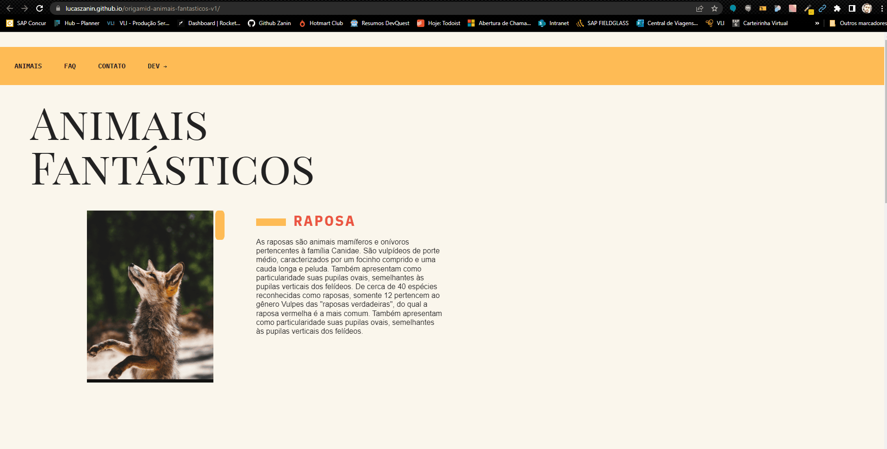

# Landing page Animais Fantásticos Projeto Inicial Curso JavaScript ES6+ Origamid

## Tabela do Conteudo
<ul>
<li><a href="#como-usar">Como usar</li>
<li><a href="#sobre">Sobre</a></li>
<li><a href="#status">Status</a></li>
<li><a href="#objetivo">Objetivo</a></li>
<li><a href="#curiosidade">Curiosidade</a></li>
<li><a href="#tenologias">Tecnologias</a></li>
<li><a href="#acessando-o-site">Acessando o site</a></li>
</ul>

## Como usar

Para utilizar os arquivos do projeto na sua maquina, você deve seguir os passos abaixos:

git clone-https://github.com/Lucaszanin/origamid-animais-fantasticos-v1.git

cd origamid-animais-fantasticos-v1 

## Sobre

O Projeto foi criado com o intuito de aplicar vários conceitos de aprendizado do curso com o javaScript.
Abaixo gir do projeto funcionando.

## Status

Projeto Nina Ateliê 🎯 concluido 👌

## Objetivo

O intuito do projeto foi aplicar os aprendizados de CSS Flexbox , CSS Grid Layout, html semântico , fontes externas , JavaScript. 
O principal objetivo do projeto foi aplicar vários conceitos do JavaScript e boas práticas em um projeto da vida real.

Alguns metodos utilizados no projeto:
HTML Semântico;
CSS FlexBox;
CSS Grid Layout;
Responsividade;
Manipulação do DOM;
ArrowFunctions;
Eventos do DOM;

## Curiosidade- Este projeto foi realizado no curso da Origamid JavaScript ES6+.

## Tecnologias
<ul>
<li>HTML</li>
<li>CSS</li>
<li>JAVSCRIPT</li>
<li>GIT</li>
</ul>

## Acessando o site

Para acessar o site do projeto Animais Fantásticos, por favor use este link : <a href="https://lucaszanin.github.io/origamid-animais-fantasticos-v1/" target="_blank">Animais Fantásticos</a>